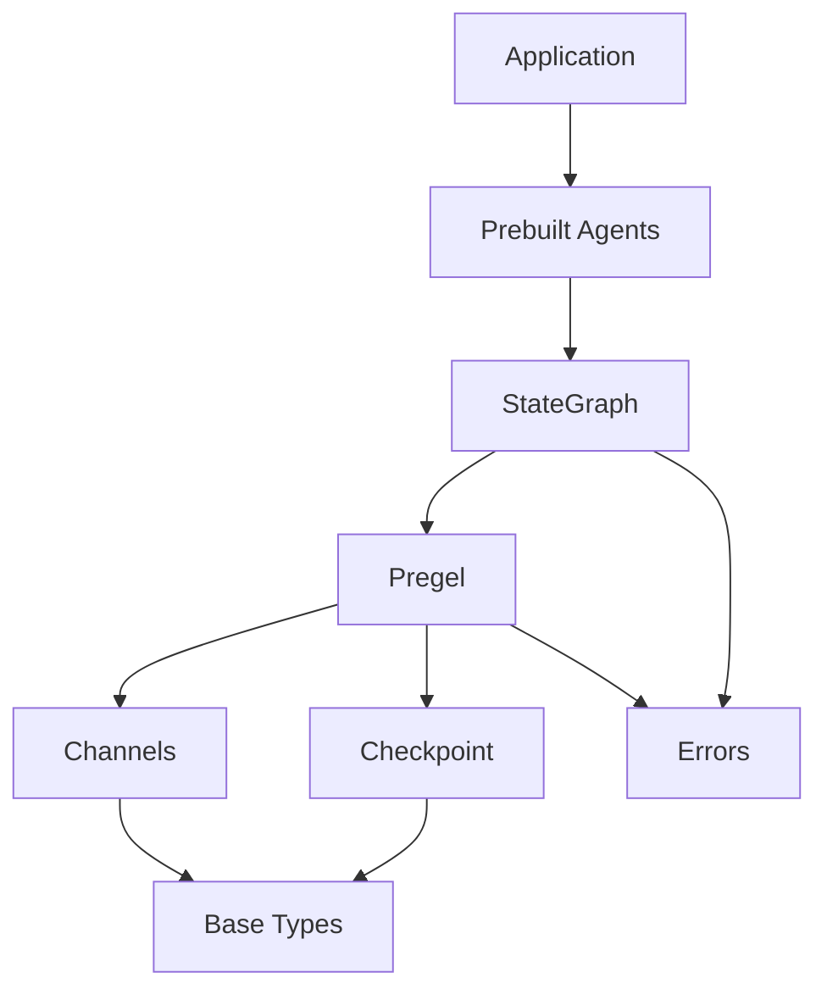

# 整体架构

## 分层架构设计

LangGraphJS 采用清晰的分层架构，将复杂系统拆分为职责明确的层次。这种设计使得代码易于理解、维护和扩展。

### 架构分层图

```
┌─────────────────────────────────────────────────────────────────┐
│                        Application Layer                         │
│                    (User's Application Code)                     │
└─────────────────────────────────────────────────────────────────┘
                              ▼
┌─────────────────────────────────────────────────────────────────┐
│                      High-Level API Layer                        │
│   ┌─────────────┐  ┌─────────────┐  ┌─────────────────────┐    │
│   │ createReact │  │  Swarm API  │  │  Custom Agent API   │    │
│   │   Agent     │  │             │  │                     │    │
│   └─────────────┘  └─────────────┘  └─────────────────────┘    │
└─────────────────────────────────────────────────────────────────┘
                              ▼
┌─────────────────────────────────────────────────────────────────┐
│                       Graph Abstraction Layer                    │
│   ┌─────────────────────────────────────────────────────────┐   │
│   │                    StateGraph                            │   │
│   │  - addNode()  - addEdge()  - compile()                  │   │
│   └─────────────────────────────────────────────────────────┘   │
└─────────────────────────────────────────────────────────────────┘
                              ▼
┌─────────────────────────────────────────────────────────────────┐
│                       Pregel Engine Layer                        │
│   ┌─────────────┐  ┌─────────────┐  ┌─────────────────────┐    │
│   │ PregelLoop  │  │ PregelRunner│  │  Channel Manager    │    │
│   │             │  │             │  │                     │    │
│   │ - step()    │  │ - execute() │  │  - read/write       │    │
│   │ - tasks     │  │ - parallel  │  │  - subscribe        │    │
│   └─────────────┘  └─────────────┘  └─────────────────────┘    │
└─────────────────────────────────────────────────────────────────┘
                              ▼
┌─────────────────────────────────────────────────────────────────┐
│                         Channel Layer                            │
│   ┌─────────────┐  ┌─────────────┐  ┌─────────────────────┐    │
│   │ LastValue   │  │   Topic     │  │  NamedBarrierValue  │    │
│   │             │  │             │  │                     │    │
│   └─────────────┘  └─────────────┘  └─────────────────────┘    │
│   ┌─────────────┐  ┌─────────────┐                             │
│   │  AnyValue   │  │ BinOp聚合   │                             │
│   └─────────────┘  └─────────────┘                             │
└─────────────────────────────────────────────────────────────────┘
                              ▼
┌─────────────────────────────────────────────────────────────────┐
│                      Checkpoint Layer                            │
│   ┌─────────────┐  ┌─────────────┐  ┌─────────────────────┐    │
│   │ MemorySaver │  │ PostgresDb  │  │    RedisSaver       │    │
│   │             │  │   Saver     │  │                     │    │
│   └─────────────┘  └─────────────┘  └─────────────────────┘    │
└─────────────────────────────────────────────────────────────────┘
                              ▼
┌─────────────────────────────────────────────────────────────────┐
│                      Storage Layer                               │
│   ┌─────────────┐  ┌─────────────┐  ┌─────────────────────┐    │
│   │   Memory    │  │ PostgreSQL  │  │      Redis          │    │
│   └─────────────┘  └─────────────┘  └─────────────────────┘    │
└─────────────────────────────────────────────────────────────────┘
```

## 各层职责详解

### 1. Application Layer（应用层）

用户的实际业务代码，使用 LangGraphJS 提供的 API 构建 AI 应用。

```typescript
// 用户代码示例
import { createReactAgent } from "@langchain/langgraph";

const agent = createReactAgent({
  llm: chatModel,
  tools: [searchTool, calculatorTool],
});

const result = await agent.invoke({
  messages: [{ role: "user", content: "计算 1+1" }]
});
```

### 2. High-Level API Layer（高层 API 层）

提供预构建的 Agent 模式，封装常见的工作流。

#### createReactAgent

```typescript
// libs/langgraph-core/src/prebuilt/react_agent_executor.ts
export function createReactAgent<
  StateType extends StateTypeAnnotatedDefinition | undefined
>(params: CreateReactAgentParams<StateType>) {
  const { llm, tools, ... } = params;
  
  // 1. 创建工具节点
  const toolNode = new ToolNode(tools);
  
  // 2. 创建 ReAct 图
  const workflow = new StateGraph(MessagesAnnotation)
    .addNode("agent", createReactAgentNode(llm))
    .addNode("tools", toolNode)
    // ... 添加边
  
  return workflow.compile();
}
```

#### Swarm API

```typescript
// libs/langgraph-swarm/src/swarm.ts
export function createSwarm(
  agents: Agent[]
): StateGraph<SwarmState> {
  // 多 Agent 协作逻辑
}
```

### 3. Graph Abstraction Layer（图抽象层）

提供 StateGraph 等高级图构建 API。

#### StateGraph 核心代码

```typescript
// libs/langgraph-core/src/graph/state.ts
export class StateGraph<
  SD extends StateDefinition,
  I extends StateDefinition = SD,
  O extends StateDefinition = SD
> {
  nodes: Record<string, NodeSpec> = {};
  edges: Set<string> = new Set();
  
  addNode<NodeKey extends string>(
    id: NodeKey,
    action: RunnableLike<...>
  ): this {
    // 添加节点到图
    this.nodes[id] = {
      runnable: _coerceToRunnable(action),
      metadata: {},
    };
    return this;
  }
  
  addEdge(startKey: string, endKey: string): this {
    // 添加边
    this.edges.add(`${startKey}|${endKey}`);
    return this;
  }
  
  compile(options: CompileOptions = {}): CompiledStateGraph {
    // 编译图为 Pregel 实例
    const pregel = new Pregel({
      nodes: this.nodes,
      channels: this.channels,
      ...options
    });
    return pregel;
  }
}
```

### 4. Pregel Engine Layer（Pregel 引擎层）

核心执行引擎，实现图的执行逻辑。

#### Pregel 主类

```typescript
// libs/langgraph-core/src/pregel/index.ts
export class Pregel<
  Nodes extends StrRecord<string, PregelNode>,
  Channels extends StrRecord<string, BaseChannel>
> extends Runnable<...> {
  
  async *stream(
    input: PregelInputType,
    options?: Partial<PregelOptions<Nodes, Channels>>
  ): AsyncGenerator<PregelOutputType> {
    // 创建执行循环
    const loop = new PregelLoop({
      ...
    });
    
    // 执行循环
    for await (const { tasks, checkpoint, step } of loop) {
      // 打印调试信息
      if (this.debug) printStepTasks(step, tasks);
      
      // 执行任务
      const runner = new PregelRunner();
      await runner.executeTasks(tasks, { ... });
      
      // 应用写入
      _applyWrites(checkpoint, ...);
    }
  }
}
```

#### PregelLoop（执行循环）

```typescript
// libs/langgraph-core/src/pregel/loop.ts
export class PregelLoop {
  step: number = 0;
  checkpoint: Checkpoint;
  
  async *transform(...) {
    while (true) {
      // 1. 准备下一个任务
      const tasks = await this._prepareNextTasks();
      
      // 2. 检查是否结束
      if (tasks.length === 0) break;
      
      // 3. 产生任务给调用者
      yield { tasks, checkpoint: this.checkpoint, step: this.step };
      
      // 4. 等待任务执行完成
      await this._waitForTasks(tasks);
      
      // 5. 增加步数
      this.step++;
      
      // 6. 检查递归限制
      if (this.step > this.recursionLimit) {
        throw new GraphRecursionError(...);
      }
    }
  }
  
  async _prepareNextTasks(): Promise<PregelExecutableTask[]> {
    // 核心算法：根据当前状态准备要执行的任务
    return _prepareNextTasks(this.checkpoint, this.nodes, this.channels);
  }
}
```

#### PregelRunner（执行器）

```typescript
// libs/langgraph-core/src/pregel/runner.ts
export class PregelRunner {
  async *executeTasks(
    tasks: PregelExecutableTask[],
    options: ExecuteOptions
  ): AsyncGenerator<void> {
    // 并发执行任务
    const promises = tasks.map(async (task) => {
      try {
        const output = await task.runnable.invoke(task.input, task.config);
        yield { task, output };
      } catch (error) {
        yield { task, error };
      }
    });
    
    await Promise.all(promises);
  }
}
```

### 5. Channel Layer（通道层）

实现不同的数据通道类型，支持多样的状态更新策略。

```typescript
// libs/langgraph-core/src/channels/base.ts
export abstract class BaseChannel<
  ValueType,
  UpdateType,
  CheckpointType
> {
  abstract lg_is_channel: true;
  abstract lc_graph_name: string;
  
  // 从检查点恢复
  abstract fromCheckpoint(checkpoint?: CheckpointType): this;
  
  // 更新通道值
  abstract update(values: UpdateType[]): boolean;
  
  // 获取当前值
  abstract get(): ValueType;
  
  // 创建检查点
  abstract checkpoint(): CheckpointType | undefined;
}
```

### 6. Checkpoint Layer（检查点层）

实现状态持久化接口，支持多种存储后端。

```typescript
// libs/langgraph-checkpoint/src/base.ts
export abstract class BaseCheckpointSaver {
  // 保存检查点
  abstract save(
    checkpoint: Checkpoint,
    config: RunnableConfig
  ): Promise<void>;
  
  // 获取检查点
  abstract get(config: RunnableConfig): Promise<Checkpoint | undefined>;
  
  // 列出检查点
  abstract list(
    config: RunnableConfig,
    options?: CheckpointListOptions
  ): AsyncIterable<CheckpointTuple>;
}
```

## 图执行流程

### 完整执行流程

```
┌─────────────────────────────────────────────────────────────────┐
│  1. invoke() / stream() 调用                                    │
└─────────────────────────────────────────────────────────────────┘
                              ▼
┌─────────────────────────────────────────────────────────────────┐
│  2. 输入映射 (mapInput)                                          │
│     - 将用户输入转换为通道值                                      │
└─────────────────────────────────────────────────────────────────┘
                              ▼
┌─────────────────────────────────────────────────────────────────┐
│  3. 创建 PregelLoop                                              │
│     - 加载/创建检查点                                            │
│     - 初始化通道                                                 │
└─────────────────────────────────────────────────────────────────┘
                              ▼
┌─────────────────────────────────────────────────────────────────┐
│  4. 执行循环 (for await step of loop)                            │
│                                                                 │
│  ┌─────────────────────────────────────────────────────────┐   │
│  │ Step N:                                                 │   │
│  │                                                         │   │
│  │ a) _prepareNextTasks()                                  │   │
│  │    - 扫描所有节点                                       │   │
│  │    - 检查触发条件                                       │   │
│  │    - 准备输入数据                                       │   │
│  │                                                         │   │
│  │ b) PregelRunner.executeTasks()                          │   │
│  │    - 并发执行任务                                       │   │
│  │    - 捕获异常                                           │   │
│  │                                                         │   │
│  │ c) _applyWrites()                                       │   │
│  │    - 收集任务写入                                       │   │
│  │    - 更新通道值                                         │   │
│  │    - 更新检查点                                         │   │
│  │                                                         │   │
│  │ d) 检查是否结束                                         │   │
│  │    - 无任务 → 结束                                      │   │
│  │    - 达到递归限制 → 错误                                │   │
│  │    - 否则 → Step N+1                                    │   │
│  └─────────────────────────────────────────────────────────┘   │
└─────────────────────────────────────────────────────────────────┘
                              ▼
┌─────────────────────────────────────────────────────────────────┐
│  5. 读取输出通道 (readChannels)                                   │
└─────────────────────────────────────────────────────────────────┘
                              ▼
┌─────────────────────────────────────────────────────────────────┐
│  6. 返回结果                                                    │
└─────────────────────────────────────────────────────────────────┘
```

### 单步执行详解

```typescript
// 伪代码展示单步执行流程
async function executeStep(step: number) {
  // 1. 准备任务
  const tasks = [];
  for (const [nodeName, nodeSpec] of Object.entries(pregel.nodes)) {
    // 检查节点是否应该触发
    const shouldTrigger = nodeSpec.triggers.some(
      channel => channels[channel].isAvailable()
    );
    
    if (shouldTrigger) {
      // 读取输入通道
      const input = await readChannels(
        nodeSpec.channels,
        channels
      );
      
      tasks.push({
        name: nodeName,
        runnable: nodeSpec.runnable,
        input: input,
        writes: []
      });
    }
  }
  
  // 2. 执行任务
  await Promise.all(tasks.map(async task => {
    try {
      const output = await task.runnable.invoke(task.input);
      task.writes.push([TASKS, output]);
    } catch (error) {
      task.writes.push([ERROR, error]);
    }
  }));
  
  // 3. 应用写入
  for (const task of tasks) {
    for (const [channel, value] of task.writes) {
      channels[channel].update([value]);
    }
  }
}
```

## 数据流与控制流

### 数据流

```
输入 ──► INPUT 通道
            │
            ▼
       ┌─────────┐
       │ Node A  │──► 写入通道 X
       └─────────┘      │
                        ▼
                   ┌─────────┐
                   │ Node B  │──► 写入 OUTPUT 通道
                   └─────────┘      │
                                    ▼
                                 输出
```

### 控制流

```
__start__ ──► Node A
                  │
         ┌────────┴────────┐
         ▼                 ▼
     Node B           Node C
         │                 │
         └────────┬────────┘
                  ▼
                END
```

## 关键设计模式

### 1. 策略模式（Strategy Pattern）

不同的 Channel 类型实现了不同的状态更新策略：

```typescript
// LastValue - 直接替换
class LastValue extends BaseChannel {
  update(values: UpdateType[]): boolean {
    this.value = values[values.length - 1];
    return true;
  }
}

// BinaryOperator - 二元操作聚合
class BinaryOperatorAggregate extends BaseChannel {
  update(values: UpdateType[]): boolean {
    for (const value of values) {
      this.value = this.operator(this.value, value);
    }
    return values.length > 0;
  }
}

// Topic - 消息队列
class Topic extends BaseChannel {
  update(values: UpdateType[]): boolean {
    this.items.push(...values);
    return true;
  }
  
  consume(): boolean {
    if (this.items.length === 0) return false;
    this.items = []; // 清空
    return true;
  }
}
```

### 2. 观察者模式（Observer Pattern）

节点订阅通道变化：

```typescript
// PregelNode 定义
class PregelNode {
  channels: Record<string, string>;  // 订阅的通道
  triggers: string[];                // 触发通道
  
  // 当触发通道有值时，节点被激活
  async invoke(config: RunnableConfig) {
    const input = await ChannelRead.doRead(
      this.channels,
      config
    );
    return this.runnable.invoke(input);
  }
}
```

### 3. 命令模式（Command Pattern）

使用 Command 对象控制执行流：

```typescript
class Command<T> {
  constructor(params: {
    resume?: T;           // 恢复值
    update?: Record<string, any>;  // 状态更新
    goto?: string | string[];      // 跳转到指定节点
  }) {}
}

// 在中断后恢复
await app.invoke(new Command({
  resume: { approve: true },
  goto: "nextNode"
}));
```

### 4. 装饰器模式（Decorator Pattern）

Checkpoint 装饰执行过程：

```typescript
// 带 Checkpoint 的执行
const app = graph.compile({ checkpointer });

// Checkpoint 在关键节点保存状态:
// 1. 每步开始前
// 2. 中断发生时
// 3. 异常发生时
```

## 并发模型

### Actor 模型实现

LangGraphJS 的 Pregel 引擎基于 Actor 模型实现并发：

```
┌─────────┐    ┌─────────┐    ┌─────────┐
│ Node A  │    │ Node B  │    │ Node C  │
│ Actor   │    │ Actor   │    │ Actor   │
└────┬────┘    └────┬────┘    └────┬────┘
     │              │              │
     └──────────────┼──────────────┘
                    │
                    ▼
            ┌───────────────┐
            │  Channel Bus  │
            │  (消息总线)   │
            └───────────────┘
```

### 同步屏障

每个超级步骤之间有一个同步屏障：

```
Step 1: [Node A] [Node B] [Node C] 并发执行
         │       │       │
         └───────┴───────┘  同步屏障
                 │
Step 2:          ▼
        [Node D] [Node E]  并发执行
```

实现代码：

```typescript
// libs/langgraph-core/src/pregel/loop.ts
async *transform() {
  while (true) {
    // 准备所有任务
    const tasks = await this._prepareNextTasks();
    
    if (tasks.length === 0) break;
    
    // 同步点：等待所有任务准备完成
    yield { tasks, ... };
    
    // 执行所有任务
    await this._waitForTasks(tasks);
    
    // 屏障：所有任务完成后再继续
    this.step++;
  }
}
```

## 错误处理架构

### 错误类型层次

```typescript
// libs/langgraph-core/src/errors.ts

// 基础错误
class LangGraphError extends Error {}

// 图执行错误
class GraphError extends LangGraphError {}

// 递归错误
class GraphRecursionError extends GraphError {
  // 达到最大递归步数
}

// 值错误
class GraphValueError extends GraphError {
  // 值验证失败
}

// 中断错误
class GraphInterrupt extends GraphError {
  interrupts: Interrupt[];
}

// 空通道错误
class EmptyChannelError extends GraphError {
  // 读取空通道
}
```

### 错误传播

```typescript
// 任务执行中的错误处理
async executeTask(task: PregelExecutableTask) {
  try {
    const output = await task.runnable.invoke(task.input);
    return { success: true, output };
  } catch (error) {
    // 错误会被包装并传播
    task.writes.push([ERROR, error]);
    throw error;
  }
}

// Pregel 层的错误处理
async *stream() {
  for await (const step of loop) {
    try {
      await runner.executeTasks(step.tasks);
    } catch (error) {
      if (error instanceof GraphRecursionError) {
        // 特殊处理递归错误
      } else if (error instanceof GraphInterrupt) {
        // 中断是可恢复的
        // 保存当前状态
      } else {
        // 其他错误重新抛出
        throw error;
      }
    }
  }
}
```

## 状态持久化架构

### Checkpoint 结构

```typescript
interface Checkpoint {
  v: number;           // 版本号
  id: string;          // 检查点 ID
  ts: string;          // 时间戳
  
  channel_values: Record<string, any>;    // 通道值
  channel_versions: Record<string, number>; // 通道版本
  versions_seen: Record<string, Record<string, number>>; // 已见版本
}
```

### 保存流程

```typescript
// libs/langgraph-core/src/pregel/algo.ts
export function createCheckpoint(
  checkpoint: Checkpoint,
  channels: Record<string, BaseChannel>,
  step: number
): Checkpoint {
  // 从所有通道收集值
  const channel_values = {};
  for (const [key, channel] of Object.entries(channels)) {
    try {
      channel_values[key] = channel.checkpoint();
    } catch (e) {
      // 跳过不支持 checkpoint 的通道
    }
  }
  
  return {
    ...checkpoint,
    id: uuid6(step),
    ts: new Date().toISOString(),
    channel_values,
  };
}
```

## 模块间依赖关系

### 依赖图



### 导入依赖链

```typescript
// 用户导入
import { createReactAgent } from "@langchain/langgraph";

// 内部依赖链
// @langchain/langgraph
//   └── @langchain/langgraph-core
//       ├── ./graph/state.ts
//       │   └── ./graph/graph.ts
//       │   └── ./pregel/index.ts
//       │       ├── ./pregel/loop.ts
//       │       ├── ./pregel/runner.ts
//       │       └── ./channels/base.ts
//       └── @langchain/langgraph-checkpoint
```

## 小结

本节详细介绍了 LangGraphJS 的整体架构设计：

- ✅ 分层架构与各层职责
- ✅ 图执行流程详解
- ✅ 数据流与控制流
- ✅ 关键设计模式
- ✅ 并发模型
- ✅ 错误处理架构
- ✅ 状态持久化架构
- ✅ 模块间依赖关系

理解了整体架构后，我们将深入 Pregel 系统的内部实现。

## 下一章

- [Pregel 系统](/architecture/pregel) - Actor 模型、图执行引擎
- [通道机制](/architecture/channel) - Channel 类型、状态管理
- [状态管理](/architecture/state) - 状态机、中断、恢复
- [Checkpoint 机制](/architecture/checkpoint) - 持久化、时间旅行