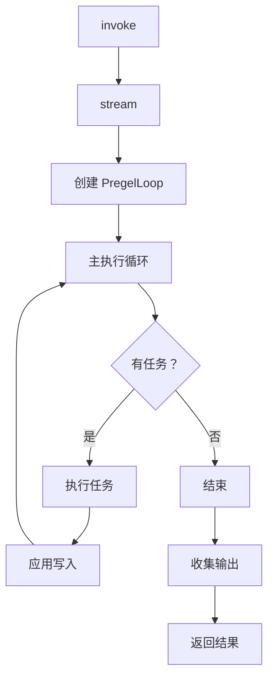

# Pregel 引擎

Pregel 引擎是 LangGraphJS 的核心执行引擎，负责图的执行、任务调度和状态管理。本章将深入解析 Pregel 引擎的完整实现。

## Pregel 主类结构

### 类定义与属性

```typescript
// libs/langgraph-core/src/pregel/index.ts
export class Pregel<
  Nodes extends StrRecord<string, PregelNode>,
  Channels extends StrRecord<string, BaseChannel>,
  InputType = unknown,
  OutputType = unknown
> extends Runnable<
  InputType | Command,
  OutputType,
  PregelOptions<Nodes, Channels>
> implements PregelInterface<Nodes, Channels> {
  
  // === 节点配置 ===
  nodes: Nodes;                    // 节点定义
  channels: Channels;              // 通道定义
  inputChannels: string | string[] | Record<string, string>;
  outputChannels: string | string[];
  
  // === 执行配置 ===
  autoValidate: boolean = true;    // 是否自动验证
  streamMode: StreamMode[] = ["values"];
  streamKeys?: string | string[];
  debug: boolean = false;          // 调试模式
  
  // === 持久化配置 ===
  checkpointer?: BaseCheckpointSaver | undefined;
  interruptBefore?: All | string[];
  interruptAfter?: All | string[];
  
  // === 缓存配置 ===
  cache?: BaseCache;
  
  // === 重试配置 ===
  retryPolicy?: RetryPolicy;
  
  constructor(fields: PregelParams<Nodes, Channels>) {
    super(fields);
    this.nodes = fields.nodes;
    this.channels = fields.channels;
    this.inputChannels = fields.inputChannels;
    this.outputChannels = fields.outputChannels ?? Object.keys(this.nodes);
    this.autoValidate = fields.autoValidate ?? true;
    this.streamMode = fields.streamMode ?? ["values"];
    this.checkpointer = fields.checkpointer;
    this.interruptBefore = fields.interruptBefore;
    this.interruptAfter = fields.interruptAfter;
    this.debug = fields.debug ?? false;
    this.cache = fields.cache;
    this.retryPolicy = fields.retryPolicy;
    
    // 自动验证图结构
    if (this.autoValidate) {
      validateGraph(this);
    }
  }
}
```

### 核心方法概览

```typescript
class Pregel<Nodes, Channels> {
  // === 执行方法 ===
  invoke(input: InputType, options?: PregelOptions): Promise<OutputType>;
  stream(input: InputType, options?: PregelOptions): AsyncGenerator<OutputType>;
  batch(inputs: InputType[], options?: PregelOptions): Promise<OutputType[]>;
  
  // === 事件流 ===
  streamEvents(
    input: InputType,
    options: { version: "v2" | "v3" }
  ): AsyncGenerator<StreamEvent>;
  
  // === 状态管理 ===
  getState(config: RunnableConfig): Promise<StateSnapshot>;
  updateState(config: RunnableConfig, values: Record<string, unknown>): void;
  gettudorHistory(config: RunnableConfig): AsyncGenerator<StateSnapshot>;
  
  // === 配置方法 ===
  withConfig(config: PregelOptions): Pregel<Nodes, Channels>;
}
```

## invoke 方法实现

### 完整调用链

```typescript
async invoke(
  input: PregelInputType,
  options?: Partial<PregelOptions<Nodes, Channels>>
): Promise<PregelOutputType> {
  // 1. 转换为流式处理
  const stream = await this.stream(input, {
    ...options,
    subgraphs: options?.subgraphs ?? false,
  });
  
  // 2. 收集所有输出
  const ['#']: Record<string, unknown> = {};
  
  for await (const chunk of stream) {
    // 合并输出
    Object.assign(output, chunk);
  }
  
  // 3. 返回最终结果
  return output as PregelOutputType;
}
```

### 执行流程



## stream 方法实现

### 异步生成器

```typescript
async *stream(
  input: PregelInputType,
  options?: Partial<PregelOptions<Nodes, Channels>>
): AsyncGenerator<PregelOutputType> {
  // 1. 确保配置
  const config = await ensureLangGraphConfig(options);
  
  // 2. 创建输入流
  const input stream = new ReadableStream({
    start: (controller) => {
      controller.enqueue(mapInput(this.inputChannels, input));
      controller.close();
    }
  });
  
  // 3. 创建 PregelLoop
  const loop = new PregelLoop({
    input: inputStream,
    config,
    checkpointer: this.checkpointer,
    nodes: this.nodes,
    channels: this.channels,
    interruptBefore: this.interruptBefore,
    interruptAfter: this.interruptAfter,
    recursionLimit: config.recursionLimit ?? 25,
  });
  
  // 4. 执行循环
  try {
    for await (const {
      tasks,
      checkpoint,
      step,
      stop
    } of loop.transform(inputStream)) {
      
      // 5. 创建执行器
      const runner = new PregelRunner();
      
      // 6. 执行任务
      await runner.executeTasks(tasks, {
        config,
        stream: this._createStreamOutput(options),
        retryPolicy: this.retryPolicy,
      });
      
      // 7. 应用写入
      _applyWrites(checkpoint, loop.channels, tasks);
      
      // 8. 产生输出
      if (!stop) {
        const output = readChannels(
          loop.channels,
          this.outputChannels
        );
        yield output;
      }
      
      // 9. 保存检查点
      if (this.checkpointer) {
        await this.checkpointer.save(checkpoint, config);
      }
    }
  } finally {
    // 10. 清理资源
    await loop.close();
  }
}
```

### 流模式处理

```typescript
enum StreamMode {
  Values = "values",           // 状态值
  Updates = "updates",         // 增量更新
  Messages = "messages",       // 消息事件
  Events = "events",           // 生命周期事件
  Debug = "debug",             // 调试信息
}

async *stream(
  input: PregelInputType,
  options?: { streamMode?: StreamMode[] }
): AsyncGenerator {
  const modes = options?.streamMode ?? this.streamMode;
  
  if (modes.includes("values")) {
    // 产生完整状态值
    for await (const values of this.streamValues(input, options)) {
      yield values;
    }
  }
  
  if (modes.includes("updates")) {
    // 产生增量更新
    for await (const updates of this.streamUpdates(input, options)) {
      yield updates;
    }
  }
  
  if (modes.includes("messages")) {
    // 产生消息事件
    for await (const messages of this.streamMessages(input, options)) {
      yield messages;
    }
  }
}
```

## PregelLoop 深度解析

### 构造函数

```typescript
// libs/langgraph-core/src/pregel/loop.ts
export class PregelLoop {
  step: number = 0;
  checkpoint: Checkpoint;
  channels: Record<string, BaseChannel>;
  
  // 配置
  readonly config: LangGraphRunnableConfig;
  readonly inputConfig: LangGraphRunnableConfig;
  readonly checkpointer?: BaseCheckpointSaver;
  
  // 状态
  private done: boolean = false;
  private status: "pending" | "done" | "interrupted" = "pending";
  
  constructor(fields: PregelLoopInit) {
    this.config = fields.config;
    this.inputConfig = fields.inputConfig;
    this.checkpointer = fields.checkpointer;
    this.nodes = fields.nodes;
    this.channels = fields.channels;
    this.interruptBefore = fields.interruptBefore;
    this.interruptAfter = fields.interruptAfter;
    this.recursionLimit = fields.recursionLimit;
    this.specs = fields.specs;
    
    // 初始化检查点
    this.checkpoint = this._initializeCheckpoint();
  }
}
```

### transform 方法（核心循环）

```typescript
async *transform(
  input: ReadableStream<Record<string, unknown>>
): AsyncGenerator<PregelLoopOutput> {
  // === 初始化阶段 ===
  
  // 1. 读取所有输入
  let inputChunks: Record<string, unknown>[] = [];
  for await (const chunk of input) {
    inputChunks.push(chunk);
  }
  
  // 2. 映射输入到通道
  const inputValues = mapInput(this.specs.inputChannels, inputChunks);
  
  // 3. 创建通道实例
  this.channels = createChannels(
    this.specs.channels,
    this.checkpoint
  );
  
  // 4. 应用输入到通道
  this._applyInput(inputValues);
  
  // === 主执行循环 ===
  
  while (!this.done) {
    // a) 检查中断（interruptBefore）
    if (this._shouldInterruptBefore()) {
      this.status = "interrupted";
      yield { tasks: [], checkpoint: this.checkpoint, step: this.step, stop: true };
      return;
    }
    
    // b) 准备下一个任务
    const tasks = await this._prepareNextTasks();
    
    // c) 检查是否结束
    if (tasks.length === 0) {
      this.done = true;
      yield { tasks: [], checkpoint: this.checkpoint, step: this.step, stop: true };
      return;
    }
    
    // d) 检查递归限制
    if (this.step >= this.recursionLimit) {
      throw new GraphRecursionError(
        `Recursion limit of ${this.recursionLimit} reached`
      );
    }
    
    // e) 产生当前步骤（给调用者执行任务）
    yield {
      tasks,
      checkpoint: this.checkpoint,
      step: this.step,
      stop: false
    };
    
    // f) 检查中断（interruptAfter）
    if (this._shouldInterruptAfter(tasks)) {
      this.status = "interrupted";
      return;
    }
    
    // g) 应用任务写入
    await this._applyWrites(tasks);
    
    // h) 更新检查点
    this.checkpoint = createCheckpoint(
      this.checkpoint,
      this.channels,
      this.step
    );
    
    // i) 保存到持久化存储
    if (this.checkpointer && this.step % 10 === 0) {
      await this.checkpointer.save(this.checkpoint, this.config);
    }
    
    // j) 步数 +1
    this.step++;
  }
}
```

### _prepareNextTasks 实现

```typescript
async _prepareNextTasks(): Promise<PregelExecutableTask[]> {
  const tasks: PregelExecutableTask[] = [];
  const seenVersions = this.checkpoint.versions_seen;
  
  // 1. 扫描所有节点
  for (const [name, nodeSpec] of Object.entries(this.nodes)) {
    // 2. 检查节点触发条件
    const shouldTrigger = this._shouldNodeTrigger(name, nodeSpec);
    if (!shouldTrigger) continue;
    
    // 3. 读取节点输入
    const input = await this._readNodeInput(nodeSpec);
    
    // 4. 创建任务配置
    const taskConfig = patchConfig(this.config, {
      runName: name,
      callbacks: this.config.callbacks?.getChild(),
      configurable: {
        ...this.config.configurable,
        [CONFIG_KEY_READ]: this._makeReadFunction(nodeSpec),
        [CONFIG_KEY_SEND]: this._makeWriteFunction(name),
        [CONFIG_KEY_CHECKPOINT_NS]: name,
      }
    });
    
    // 5. 创建可执行任务
    tasks.push({
      name,
      input,
      runnable: nodeSpec.runnable,
      config: taskConfig,
      writes: [],
      triggers: nodeSpec.triggers,
      id: uuid5(JSON.stringify({ name, step: this.step })),
    });
  }
  
  // 6. 处理定时任务（SCHEDULED）
  const scheduled = this._getScheduledTasks();
  tasks.push(...scheduled);
  
  // 7. 更新已见版本
  this._updateSeenVersions(tasks);
  
  return tasks;
}

_shouldNodeTrigger(name: string, nodeSpec: PregelNode): boolean {
  const seen = this.checkpoint.versions_seen[name] ?? {};
  
  return nodeSpec.triggers.some(channel => {
    const current = this.checkpoint.channel_versions[channel] ?? 0;
    const lastSeen = seen[channel] ?? 0;
    return current > lastSeen;  // 有新版本
  });
}

async _readNodeInput(nodeSpec: PregelNode): Promise<unknown> {
  const input: Record<string, unknown> = {};
  
  for (const [key, channelName] of Object.entries(nodeSpec.channels)) {
    try {
      input[key] = this.channels[channelName].get();
    } catch (e) {
      if (e instanceof EmptyChannelError) {
        input[key] = undefined;
      } else {
        throw e;
      }
    }
  }
  
  // 如果是数组订阅，返回数组
  if (Array.isArray(nodeSpec.channels)) {
    return Object.values(input);
  }
  
  return input;
}
```

## PregelRunner 实现

### 任务执行器

```typescript
// libs/langgraph-core/src/pregel/runner.ts
export class PregelRunner {
  async *executeTasks(
    tasks: PregelExecutableTask[],
    options: ExecuteOptions
  ): AsyncGenerator<void> {
    const { 
      taskConfigs, 
      stream,
      retryPolicy,
      maxConcurrency 
    } = options;
    
    // 创建并发控制器
    const semaphore = new Semaphore(maxConcurrency ?? Infinity);
    
    // 执行所有任务
    const promises = tasks.map(async (task, idx) => {
      // 获取并发许可
      await semaphore.acquire();
      
      try {
        const config = {
          ...task.config,
          ...taskConfigs?.[idx]
        };
        
        // 执行任务（带重试）
        const output = await this._executeWithRetry(
          task.runnable,
          task.input,
          config,
          retryPolicy
        );
        
        // 记录成功
        task.writes.push([TASKS, output]);
        
        // 流式输出
        if (stream) {
          await stream.emit("task_success", { task, output });
        }
        
      } catch (error) {
        // 记录错误
        task.writes.push([ERROR, error]);
        
        // 流式错误
        if (stream) {
          await stream.emit("task_error", { task, error });
        }
      } finally {
        // 释放许可
        semaphore.release();
      }
    });
    
    // 等待所有任务完成
    await Promise.allSettled(promises);
    
    // 检查是否有未处理的错误
    for (const task of tasks) {
      const errorWrite = task.writes.find(w => w[0] === ERROR);
      if (errorWrite && !options.suppressErrors) {
        throw errorWrite[1];
      }
    }
  }
  
  async _executeWithRetry(
    runnable: Runnable,
    input: unknown,
    config: RunnableConfig,
    retryPolicy?: RetryPolicy
  ): Promise<unknown> {
    let lastError: Error;
    let attempts = 0;
    
    while (true) {
      try {
        return await runnable.invoke(input, config);
      } catch (error) {
        lastError = error;
        attempts++;
        
        // 检查是否应该重试
        if (!retryPolicy || !this._shouldRetry(error, attempts)) {
          throw error;
        }
        
        // 计算延迟
        const delay = this._calculateDelay(retryPolicy, attempts);
        await sleep(delay);
      }
    }
  }
  
  _shouldRetry(error: Error, attempts: number): boolean {
    // 检查错误类型
    if (error instanceof GraphRecursionError) {
      return false;  // 递归错误不重试
    }
    if (error instanceof GraphInterrupt) {
      return false;  // 中断不重试
    }
    
    // 检查重试次数
    if (attempts >= 3) {
      return false;
    }
    
    return true;
  }
  
  _calculateDelay(policy: RetryPolicy, attempt: number): number {
    // 指数退避
    return policy.initialInterval * Math.pow(2, attempt - 1);
  }
}
```

## 状态持久化

### 检查点创建

```typescript
// libs/langgraph-core/src/pregel/algo.ts
export function createCheckpoint(
  checkpoint: Checkpoint,
  channels: Record<string, BaseChannel> | undefined,
  step: number,
  options?: { id?: string }
): Checkpoint {
  // 收集通道值
  let values: Record<string, unknown>;
  
  if (channels === undefined) {
    // 使用已有值
    values = checkpoint.channel_values;
  } else {
    // 从通道收集
    values = {};
    for (const k in channels) {
      if (!Object.prototype.hasOwnProperty.call(channels, k)) continue;
      try {
        values[k] = channels[k].checkpoint();
      } catch (error) {
        if (error.name === EmptyChannelError.unminifiable_name) {
          // 跳过空通道
        } else {
          throw error;
        }
      }
    }
  }
  
  return {
    v: 4,  // 版本号
    id: options?.id ?? uuid6(step),
    ts: new Date().toISOString(),
    channel_values: values,
    channel_versions: checkpoint.channel_versions,
    versions_seen: checkpoint.versions_seen,
  };
}
```

### 检查点保存

```typescript
// libs/langgraph-core/src/pregel/index.ts
async _saveCheckpoint(
  checkpoint: Checkpoint,
  config: RunnableConfig
): Promise<void> {
  if (!this.checkpointer) return;
  
  try {
    await this.checkpointer.save(checkpoint, {
      ...config,
      configurable: {
        ...config.configurable,
        checkpoint_id: checkpoint.id,
      }
    });
  } catch (error) {
    console.error("Failed to save checkpoint:", error);
    // 根据配置决定是否抛出
    if (this.debug) {
      throw error;
    }
  }
}
```

## 流式事件处理

### streamEvents 方法

```typescript
async *streamEvents(
  input: PregelInputType,
  options: { 
    version: "v2" | "v3";
    includeNames?: string[];
    includeTypes?: string[];
    excludeNames?: string[];
    excludeTypes?: string[];
  }
): AsyncGenerator<StreamEvent> {
  const stream = new StreamProtocolMessagesHandler(options);
  
  // 创建 transform
  const transformStream = this.transformStream({
    config: { streamMode: "events" },
  });
  
  // 连接输入
  const writer = transformStream.writable.getWriter();
  writer.write(input);
  writer.close();
  
  // 读取事件
  for await (const event of transformStream.readable) {
    // 过滤事件
    if (this._shouldIncludeEvent(event, options)) {
      yield event;
    }
  }
}

_shouldIncludeEvent(
  event: StreamEvent,
  options: { includeNames?: string[]; excludeNames?: string[] }
): boolean {
  const name = event.name;
  
  // 检查排除列表
  if (options.excludeNames?.includes(name)) {
    return false;
  }
  
  // 检查包含列表
  if (options.includeNames && !options.includeNames.includes(name)) {
    return false;
  }
  
  return true;
}
```

## 错误处理

### 错误类型与处理

```typescript
// libs/langgraph-core/src/errors.ts

// 递归错误
export class GraphRecursionError extends GraphError {
  constructor(message: string) {
    super(message);
    this.name = "GraphRecursionError";
  }
}

// 值错误
export class GraphValueError extends GraphError {
  constructor(message: string, data?: Record<string, unknown>) {
    super(message, data);
    this.name = "GraphValueError";
  }
}

// 中断错误
export class GraphInterrupt extends GraphError {
  interrupts: Interrupt[];
  
  constructor(interrupts: Interrupt[]) {
    super("Graph interrupted");
    this.name = "GraphInterrupt";
    this.interrupts = interrupts;
  }
}

// 空通道错误
export class EmptyChannelError extends GraphError {
  static unminifiable_name = "EmptyChannelError";
  
  constructor(message: string) {
    super(message);
    this.name = EmptyChannelError.unminifiable_name;
  }
}
```

### 错误传播

```typescript
async executeTask(task: PregelExecutableTask): Promise<void> {
  try {
    const output = await task.runnable.invoke(task.input, task.config);
    task.writes.push([TASKS, output]);
  } catch (error) {
    // 包装错误
    if (error instanceof GraphInterrupt) {
      // 中断是预期的
      task.writes.push([INTERRUPT, error.interrupts]);
    } else if (error instanceof GraphRecursionError) {
      // 递归错误，终止执行
      throw error;
    } else {
      // 其他错误
      task.writes.push([ERROR, error]);
    }
  }
}
```

## 性能优化

### 1. 增量版本检查

```typescript
_shouldNodeTrigger(name: string): boolean {
  const seen = this.checkpoint.versions_seen[name] ?? {};
  
  // 只检查有变化的通道
  return this.nodes[name].triggers.some(channel => {
    const current = this.checkpoint.channel_versions[channel] ?? 0;
    const lastSeen = seen[channel] ?? 0;
    return current > lastSeen;
  });
}
```

### 2. 通道值缓存

```typescript
class ChannelCache {
  private cache = new Map<string, {
    version: number;
    value: unknown;
  }>();
  
  get(channel: string, version: number): unknown {
    const cached = this.cache.get(channel);
    if (cached?.version === version) {
      return cached.value;
    }
    return undefined;
  }
  
  set(channel: string, version: number, value: unknown): void {
    this.cache.set(channel, { version, value });
  }
}
```

### 3. 批量写入

```typescript
async _applyWrites(tasks: PregelExecutableTask[]): Promise<void> {
  // 收集所有写入
  const writesByChannel = new Map<string, unknown[]>();
  
  for (const task of tasks) {
    for (const [channel, value] of task.writes) {
      if (!writesByChannel.has(channel)) {
        writesByChannel.set(channel, []);
      }
      writesByChannel.get(channel)!.push(value);
    }
  }
  
  // 批量应用
  const promises = [];
  for (const [channel, values] of writesByChannel) {
    promises.push(this.channels[channel].update(values));
  }
  
  await Promise.all(promises);
}
```

## 小结

本节深入解析了 LangGraphJS 的 Pregel 引擎：

- ✅ Pregel 主类结构与配置
- ✅ invoke/stream 方法实现
- ✅ PregelLoop 核心执行循环
- ✅ PregelRunner 任务执行
- ✅ 状态持久化机制
- ✅ 流式事件处理
- ✅ 错误处理与传播
- ✅ 性能优化技术

## 下一章

- [StateGraph](/core/state-graph) - 状态图构建器
- [图编译](/core/graph-compile) - compile() 流程
- [流式输出](/core/streaming) - stream()、事件流