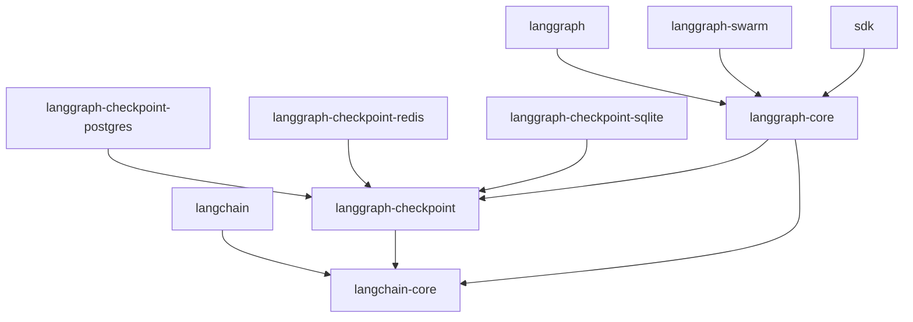

# 源码结构

## Monorepo 架构

LangGraphJS 采用 **Monorepo** 架构，将所有相关包集中在一个仓库中管理。这种结构有以下优势：

- **统一版本管理**：所有包使用相同的版本号
- **依赖共享**：避免重复安装相同依赖
- **原子提交**：跨包修改可以原子提交
- **简化 CI/CD**：统一的构建测试流程

### 目录结构

```
langgraphjs/
├── .changeset/              # Changeset 配置（版本管理）
├── .github/                 # GitHub Actions 配置
├── .vscode/                 # VSCode 工作区配置
├── docs/                    # 官方文档
├── examples/                # 示例代码
├── internal/                # 内部工具配置
├── libs/                    # 核心包目录
│   ├── checkpoint/          # @langchain/langgraph-checkpoint
│   ├── checkpoint-mongodb/  # @langchain/langgraph-checkpoint-mongodb
│   ├── checkpoint-postgres/ # @langchain/langgraph-checkpoint-postgres
│   ├── checkpoint-redis/    # @langchain/langgraph-checkpoint-redis
│   ├── checkpoint-sqlite/   # @langchain/langgraph-checkpoint-sqlite
│   ├── checkpoint-validation/ # 验证工具
│   ├── create-langgraph/    # 脚手架工具
│   ├── langgraph/           # @langchain/langgraph (主库 re-export)
│   ├── langgraph-api/       # API 服务
│   ├── langgraph-cli/       # CLI 工具
│   ├── langgraph-core/      # @langchain/langgraph-core (核心实现)
│   ├── langgraph-cua/       # CUA 模式
│   ├── langgraph-supervisor/# 监督者模式
│   ├── langgraph-swarm/     # @langchain/langgraph-swarm
│   ├── langgraph-ui/        # @langchain/langgraph-ui
│   ├── sdk/                 # @langchain/langgraph-sdk
│   ├── sdk-angular/         # Angular SDK
│   ├── sdk-react/           # React SDK
│   ├── sdk-svelte/          # Svelte SDK
│   └── sdk-vue/             # Vue SDK
├── scripts/                 # 构建脚本
├── package.json            # 根配置
├── pnpm-workspace.yaml     # pnpm 工作区配置
├── pnpm-lock.yaml          # 依赖锁定文件
├── turbo.json              # Turborepo 配置
└── tsconfig.json           # TypeScript 根配置
```

### libs/langgraph-core 详细结构

```
libs/langgraph-core/
├── package.json            # 包配置
├── tsconfig.json           # TypeScript 配置
├── src/
│   ├── index.ts            # 主入口
│   ├── web.ts              # Web 环境导出
│   ├── constants.ts        # 常量定义
│   ├── errors.ts           # 错误类型
│   ├── utils.ts            # 工具函数
│   ├── hash.js             # 哈希工具 (XXH3)
│   ├── interrupt.ts        # 中断机制
│   ├── writer.ts           # Writer 工具
│   │
│   ├── graph/              # 图相关
│   │   ├── index.ts
│   │   ├── graph.ts        # Graph, StateGraph 实现
│   │   ├── state.ts        # StateGraph 详细实现
│   │   ├── annotation.ts   # 状态注解
│   │   ├── types.ts        # 类型定义
│   │   ├── message.ts      # 消息处理
│   │   ├── messages_annotation.ts
│   │   ├── messages_reducer.ts
│   │   └── zod/            # Zod Schema 支持
│   │
│   ├── pregel/             # Pregel 引擎
│   │   ├── index.ts        # Pregel 主类
│   │   ├── algo.ts         # 核心算法
│   │   ├── loop.ts         # 执行循环
│   │   ├── read.ts         # 通道读取
│   │   ├── write.ts        # 通道写入
│   │   ├── debug.ts        # 调试工具
│   │   ├── io.ts           # 输入输出
│   │   ├── messages.ts     # 消息处理
│   │   ├── messages-v2.ts  # 消息处理 v2
│   │   ├── remote.ts       # 远程执行
│   │   ├── retry.ts        # 重试机制
│   │   ├── runner.ts       # 执行器
│   │   ├── stream.ts       # 流式处理
│   │   ├── types.ts        # 类型定义
│   │   ├── validate.ts     # 验证逻辑
│   │   ├── call.ts         # 调用处理
│   │   └── utils/          # 工具函数
│   │
│   ├── channels/           # 通道类型
│   │   ├── index.ts
│   │   ├── base.ts         # BaseChannel 基类
│   │   ├── any_value.ts    # AnyValue
│   │   ├── binop.ts        # BinaryOperator
│   │   ├── dynamic_barrier_value.ts
│   │   ├── ephemeral_value.ts
│   │   ├── last_value.ts   # LastValue
│   │   ├── named_barrier_value.ts
│   │   ├── topic.ts        # Topic
│   │   └── untracked_value.ts
│   │
│   ├── prebuilt/           # 预构建组件
│   │   ├── index.ts
│   │   ├── agent_executor.ts
│   │   ├── chat_agent_executor.ts
│   │   ├── react_agent_executor.ts
│   │   ├── tool_executor.ts
│   │   ├── tool_node.ts    # ToolNode 实现
│   │   ├── interrupt.ts
│   │   └── agentName.ts
│   │
│   ├── stream/             # 流式处理
│   │   ├── index.ts
│   │   └── ...
│   │
│   ├── state/              # 状态管理
│   │   ├── index.ts
│   │   ├── schema.ts
│   │   └── ...
│   │
│   ├── func/               # 函数式 API
│   │   ├── index.ts
│   │   ├── entrypoint.ts
│   │   └── task.ts
│   │
│   └── setup/              # 初始化配置
│       └── async_local_storage.ts
└── dist/                   # 构建产物
```

## 包间依赖关系

### 依赖图

```
@langchain/langgraph (主库 - re-export)
└── @langchain/langgraph-core (核心实现)
    ├── @langchain/langgraph-checkpoint (持久化基础)
    │   └── @langchain/core (LangChain 核心)
    │
    └── @langchain/core

@langchain/langgraph-checkpoint-postgres
└── @langchain/langgraph-checkpoint

@langchain/langgraph-checkpoint-redis
└── @langchain/langgraph-checkpoint

@langchain/langgraph-checkpoint-sqlite
└── @langchain/langgraph-checkpoint

@langchain/langgraph-swarm
└── @langchain/langgraph-core

@langchain/sdk
└── @langchain/langgraph-core
```

### 依赖解析顺序



### package.json 配置示例

```json
// libs/langgraph-core/package.json
{
  "name": "@langchain/langgraph-core",
  "version": "0.3.5",
  "type": "module",
  "main": "./dist/index.js",
  "types": "./dist/index.d.ts",
  "exports": {
    ".": {
      "import": "./dist/index.js",
      "require": "./dist/index.cjs"
    }
  },
  "dependencies": {
    "@langchain/core": "^1.1.44",
    "@langchain/langgraph-checkpoint": "workspace:*"
  }
}
```

## 关键模块职责

### 1. Graph 层 (libs/langgraph-core/src/graph/)

| 文件 | 职责 | 核心类/函数 |
|------|------|-------------|
| graph.ts | 图的基础实现 | Graph, Branch, NodeSpec |
| state.ts | 状态图实现 | StateGraph, CompiledStateGraph |
| annotation.ts | 状态注解 | Annotation, AnnotationRoot |
| types.ts | 类型定义 | StateDefinition, ExtractStateType |
| message.ts | 消息处理 | pushMessage, messagesStateReducer |

### 2. Pregel 层 (libs/langgraph-core/src/pregel/)

| 文件 | 职责 | 核心类/函数 |
|------|------|-------------|
| index.ts | Pregel 主类 | Pregel, Channel |
| algo.ts | 核心算法 | _applyWrites, _localRead, _prepareNextTasks |
| loop.ts | 执行循环 | PregelLoop |
| read.ts | 通道读取 | PregelNode, ChannelRead |
| write.ts | 通道写入 | ChannelWrite, PASSTHROUGH |
| runner.ts | 执行器 | PregelRunner |
| stream.ts | 流式处理 | IterableReadableWritableStream |
| debug.ts | 调试工具 | printStepCheckpoint |

### 3. Channels 层 (libs/langgraph-core/src/channels/)

| 文件 | 职责 | 核心类 |
|------|------|--------|
| base.ts | 通道基类 | BaseChannel |
| any_value.ts | 任意值 | AnyValue |
| binop.ts | 二元操作 | BinaryOperatorAggregate |
| last_value.ts | 最后值 | LastValue, LastValueAfterFinish |
| named_barrier_value.ts | 命名屏障 | NamedBarrierValue |
| topic.ts | 主题通道 | Topic |

### 4. Checkpoint 层 (libs/checkpoint/src/)

| 文件 | 职责 | 核心类 |
|------|------|--------|
| base.ts | 基础接口 | BaseCheckpointSaver |
| memory.ts | 内存存储 | MemorySaver |
| types.ts | 类型定义 | Checkpoint, CheckpointTuple |
| id.ts | ID 生成 | uuid5, uuid6 |

### 5. Prebuilt 层 (libs/langgraph-core/src/prebuilt/)

| 文件 | 职责 | 核心函数 |
|------|------|----------|
| react_agent_executor.ts | ReAct Agent | createReactAgent |
| tool_node.ts | 工具执行节点 | ToolNode |
| tool_executor.ts | 工具执行器 | ToolExecutor |
| chat_agent_executor.ts | 聊天 Agent | createChatAgentExecutor |

## 核心执行流程

### 图编译流程

```
StateGraph
    │
    ▼
addNode() ──► 添加节点到 graph.nodes
    │
    ▼
addEdge() ──► 添加边到 graph.edges
    │
    ▼
compile()
    │
    ├──► validate() 验证图结构
    │
    ├──► create Pregel instance
    │
    ├──► build channel spec
    │
    └──► return CompiledGraph
```

### 运行时执行流程

```
invoke(input)
    │
    ▼
PregelLoop
    │
    ├──► Step 1
    │    ├──► _prepareNextTasks()
    │    ├──► execute tasks
    │    └──► _applyWrites()
    │
    ├──► Step 2
    │    └──► ...
    │
    └──► return result
```

### 状态存储流程

```
Checkpoint
    │
    ├──► save(checkpoint, config)
    │    │
    │    └──► 存储到数据库
    │
    └──► get(config)
         │
         └──► 从数据库读取
```

## 代码组织约定

### 文件命名

- **索引文件**: `index.ts` - 统一导出
- **实现文件**: `snake_case.ts` - 具体实现
- **测试文件**: `*.test.ts` - 单元测试
- **类型文件**: `types.ts` - 类型定义

### 导出模式

```typescript
// 统一导出模式
// index.ts
export * from "./graph/index.js";
export * from "./pregel/index.js";
export * from "./channels/index.js";
export * from "./errors.js";
export * from "./constants.js";
```

### 内部 vs 公共 API

```typescript
// 内部函数（不导出）
function _internalHelper() {
  // ...
}

// 公共 API（导出）
export function publicAPI() {
  // ...
}

// 带下划线前缀表示内部使用
export function _coerceToRunnable() {
  // ...
}
```

## 测试结构

```
libs/langgraph-core/src/
├── graph/
│   ├── state.test.ts      # StateGraph 测试
│   ├── messages_reducer.test.ts
│   ├── message.test.ts
│   └── ...
├── pregel/
│   ├── debug.test.ts      # 调试工具测试
│   ├── messages.test.ts   # 消息处理测试
│   ├── read.test.ts       # 读取功能测试
│   ├── write.test.ts      # 写入功能测试
│   ├── runner.test.ts     # 执行器测试
│   ├── validate.test.ts   # 验证逻辑测试
│   └── ...
└── ...
```

### 测试示例

```typescript
// libs/langgraph-core/src/graph/state.test.ts
import { describe, it, expect } from "@jest/globals";
import { StateGraph } from "./state.js";

describe("StateGraph", () => {
  it("should create a valid graph", () => {
    const graph = new StateGraph<{ value: number }>()
      .addNode("node1", (state) => ({ value: state.value + 1 }))
      .addEdge("__start__", "node1")
      .addEdge("node1", "__end__");
    
    const app = graph.compile();
    expect(app).toBeDefined();
  });
});
```

## 构建系统

### Turborepo Pipeline

```json
// turbo.json
{
  "tasks": {
    "build:internal": {
      "dependsOn": ["^build:internal"],
      "outputs": ["dist/**"]
    },
    "test": {
      "dependsOn": ["build:internal"]
    },
    "clean": {
      "outputs": []
    },
    "lint": {
      "outputs": []
    }
  }
}
```

### 构建命令

```bash
# 构建所有包
pnpm build

# 构建单个包
pnpm turbo run build:internal --filter=@langchain/langgraph-core

# 运行测试
pnpm test

# 清理构建产物
pnpm clean
```

## 小结

本节详细介绍了 LangGraphJS 的源码结构：

- ✅ Monorepo 架构优势
- ✅ 目录结构与组织
- ✅ 包间依赖关系
- ✅ 关键模块职责
- ✅ 核心执行流程
- ✅ 代码组织约定
- ✅ 测试与构建系统

理解了源码结构后，下一节我们将学习如何进行有效调试。

## 下一章

- [调试指南](/guide/debugging) - VSCode 调试配置、断点技巧
- [架构篇 - 整体架构](/architecture/overview) - 分层架构、图执行流程